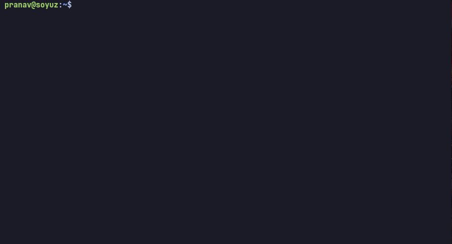

# `sinister`

`sinister` is a tool to sync and download videos from Youtube.

## config

To start using `sinister`, you need to create a config file at `/home/<username>/.config/sinister/config.toml`

- You can use the `--config` argument to pass in a alternate config file location.

It should look like this:

```toml
videoFolder = "~/Videos"

urls = [
"https://www.youtube.com/feeds/videos.xml?channel_id=UCeeFfhMcJa1kjtfZAGskOCA",
"https://www.youtube.com/feeds/videos.xml?channel_id=UCdBK94H6oZT2Q7l0-b0xmMg"
]

quality = "hd720"
```

- The `urls` are RSS feeds of the channels you want to sync.
- To extract the RSS feed of a youtube channel, see [below](#disclaimer)

> Channel URL don't work, only RSS feeds work.


## Features

- Tracks your subscription using RSS feeds and download whatever you are interested in.
- Remove the web interface and watch videos in your favorite video player.
- No recommendations, no ads, no distractions.
- Treat Youtube like a news feed.

## Installation

You can install `sinister` by downloading a binary from the [releases](https://github.com/pspiagicw/sinister/releases) page.

Or if you have the `Go` compiler installed. Use

```sh
go install github.com/pspiagicw/sinister@latest
```

If you use [`gox`](https://github.com/pspiagicw/gox) to manage binary packages, you can run

```
gox install github.com/pspiagicw/sinister@latest
```

## Usage

### `update`

- If the config file is set up, you can run `sinister update` to update the database.
- This will query the RSS feeds for the latest videos and update the databaseo


### `status`

- This shows the state of the database.
- It gives you general statistics like unwatched videos, watched videos, etc.


### `download`

- Only unwatched videos can be downloaded.
- This downloads videos according the prompt given.
- It will download it to the `videoFolder` specified in the config file.
- The download will be in 720p in the mp4 format.
- After downloading, it will mark the video as watched.


### `mark`

- This can be used to mark a video as watched.
- It can multi-select videos to mark as watched.


### `auto`

- This is a combination of `update` and `download`. 
- It will update the database and download the latest videos.
- It is designed to be used in a cron job or a systemd timer. 
- It can be used to keep your video library up to date.
- It can filter videos according to flags provided.
- See `sinister auto --help` for more information.


- Filters include `--days`



## Youtube RSS Feeds

There are multiple ways of getting the RSS feed of a youtube channel.

One sureshot method is to view the page source (of the channel page) and search for `rss`

There are some other resources for this:

- [Feeder](https://feeder.co/knowledge-base/rss-feed-creation/youtube-rss/)

## Contributing

If you want to contribute, you can open an issue or a pull request.

## Disclaimer

Downloading videos from Youtube is against their terms of service. Use at your own risk.

